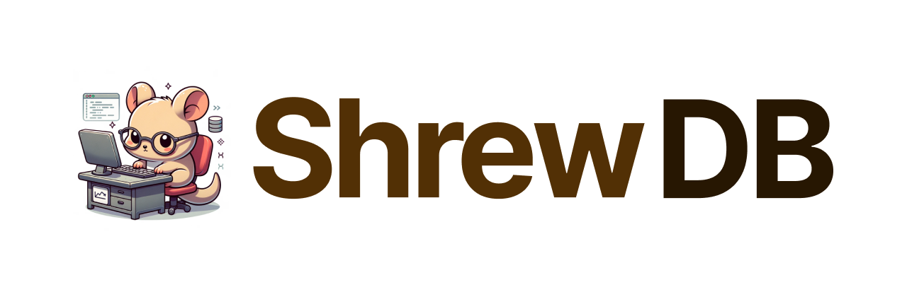

---

ShrewDB is a tiny key-value store written in Rust. It's named after the [Etruscan Shrew](https://en.wikipedia.org/wiki/Etruscan_shrew) - the world's smallest mammal.

## License

[MIT](https://choosealicense.com/licenses/mit/)
